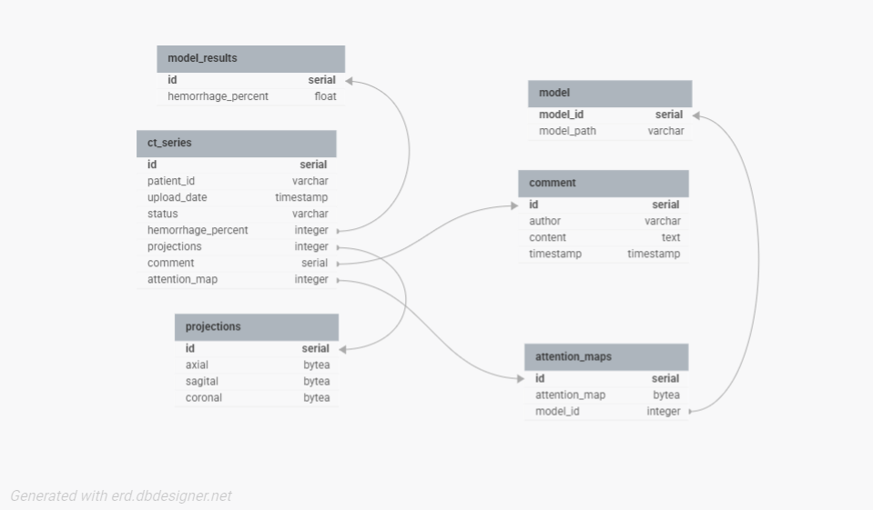

# Практическая работа № 0

### 1. Выбрать тему для Вашей новой DSS (примеры тем) или придумать и согласовать свою.

**Тема:** Разработка информационной системы для идентификации внутричерепного кровоизлияния по снимкам компьютерной томографии.

### 2. Создать репозиторий для работы над Вашей DSS.

Репозиторий создан (локально и удаленно, на Github).

### 3. Выявить первоначальные требования к Вашей DSS.

- Пользователь загружает серии КТ-снимков в формате DICOM (вплоть до 1000 снимков).
- Пользователь просматривает результаты обработки КТ-снимков.
- Пользователь добавляет комментарии к серии КТ-снимков.
- Должна быть возможность вывода проекций снимков (аксиальная, сагитальная, корональная)
- Должна быть возможность построения карт внимания.
- Обработка серии КТ-снимков должна занимать не более 4 минут.
- Вывод результата обработки в виде вероятности наличия внутричерепного кровоизлияния.

#### 4. Создать модель предметной области Вашей DSS.

##### Use-case диаграммы:

Загрузка исследования:

Получение результата обработки исследования:

Оставление комментария к исследованию:

----

### Попытка в DDD:

#### Сущности:

1. **CTSeries** - Серия КТ-снимков = исследование. 
(id, patient_id, upload_date, status, comments, hemorrhage_percent, projections, attention_maps)
2. **Projections** - Результаты построения проекций какого-то исследования. 
(id, ct_series_id, axial, sagital, coronal)
3. **Model** - Модель нейросети.
(id, model_path)
4. **Comment** - Комментарий к исследованию. 
(id, ct_series_id, author, content, timestamp)
5. **ModelResults** - Результаты обработки исследования моделью. 
(id, ct_series_id, hemorrhage_percent)
6. **AttentionMaps** - Результаты построения карт внимания по исследованию. 
(id, ct_series_id, attention_map)

#### Агрегаты:
**CTSeriesAggregate:**
- Корень - CTSeries
- Включает в себя также: Projections, Comment

**ModelAggregate:**
- Корень - Model
- Включает в себя также: ModelResults, AttentionMaps

#### Команды:
- **UploadCTSeriesCommand** - команда для загрузки исследования. 
(patient_id, files)
- **GetModelResultCommand** - команда для обработки исследования нейросетью. 
(ct_series_id, model_id)
- **AddCommentCommand** - команда для добавления комментария к исследованию. 
(ct_series_id, author, content)
- **GetProjectionsCommand** - команда для построения проекций исследования. 
(ct_series_id)
- **GetAttentionMaps** - команда для построения карт внимания к исследованию. 
(ct_series_id, model_id)

#### События:

- **CTSeriesUploadedEvent** - Событие, указывающее на успешную загрузку исследования.
(ct_series_id, patient_id, upload_date)
- **ModelResultEvent** - Событие, указывающее на завершение обработки исследования нейросетью.
(model_id, ct_series_id, hemorrhage_percent)
- **CommentAddedEvent** - Событие, указывающее на добавление комментария к исследованию.
(ct_series_id, comment_id, author, content, timestamp)
- **ProjectionsBuildedEvent** - Событие, указывающее на успешное построение проекций исследования.
(ct_series_id, projection_id, axial, sagital, coronal)
- **AttentionMapBuildedEvent** - Событие, указывающее на успешное построение карт внимания исследования.
(ct_series_id, attention_map_id, attention_map)
 
---

#### Диаграмма DDD:

---

#### Примерная диаграмма базы данных (еще может измениться):

### 5. Выбрать инструментарий (язык, IDE/редактор кода, etc.) для реализации Вашей DSS.

**Язык:** Python

**Библиотеки:** PyTorch, Pydicom, Sklearn, numpy, cv2

**Фреймворк для API:** FastAPI

**СУБД:** PostgreSQL

**Редактор кода:** Visual Studio Code

### 6. Выбрать модель данных для реализации Вашей DSS:

**На уровне приложения** - классы, соответствующие сущностям из БД (и из DDD; они вроде как будут одинаковыми?).

**На уровне хранения** - таблицы в реляционной БД (например, в PostgreSQL, схема была выше.)

### 7. Реализовать первоначальные требования (из п.3) к Вашей DSS.

Код смотреть в ./src/

Реализовал внутренню модель (создал классы для сущностей, агрегатов, команд, ивентов). **Она не подключена к API.**

### 8. Загрузить первую версию DSS на веб-хостинг (Github, Gitlab, etc.)

Загружено в Github.
