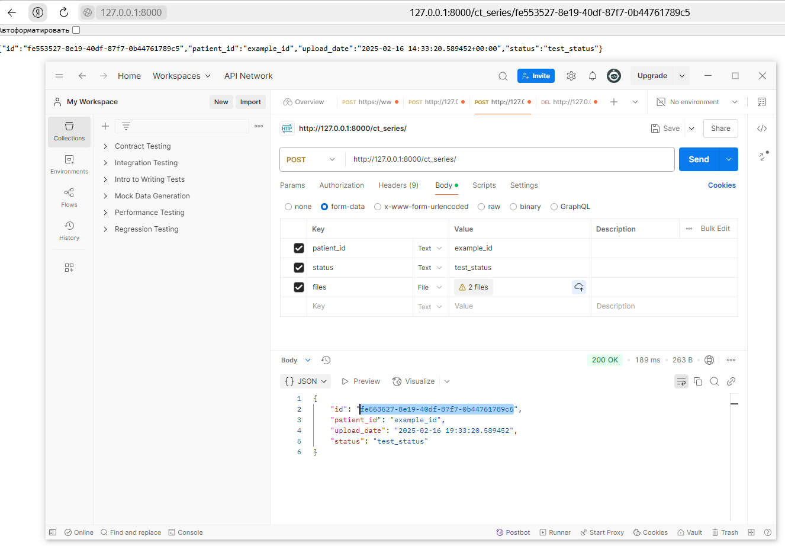

# Практическая работа № 1

### 0. Изменения в коде прошлой работы

Переоформил код сущностей. Сделал им генерацию uuid, через базовый класс BaseId.

Изменил код агрегатов. Теперь команды и ивенты лежат вместе с ними.

Начал полностью переделывать эндпоинты. Сейчас сделал только для ct_series, т.к. хочется фидбека, правильно делаю, или нет.

### 1. Подключить async-runtime к DSS.

Начал подключать async в эндпоинтах. Пример:

```
@app.post("/ct_series/", response_model=CTSeriesResponse)
async def create_ct_series(patient_id: str = Form(...), status: str = Form(...), files: List[UploadFile] = File(...), db=Depends(get_db_connection)):
    ct_series_id = BaseId()  # Генерация нового ID
    ct_series_aggregate = CTSeriesAggregate(
        ct_series=CTSeries(
            id=ct_series_id,
            patient_id=patient_id,
            upload_date=datetime.now(),
            status=status,
        )
    )
    repository = PostgreSQLCTSeriesRepository(db)
    ...
```

### 2. Подключить СУБД к DSS.

Я выбрал СУБД PostgreSQL.

СУБД была подключена.

Подключение к PostgreSQL проивзожу при помощи библиотеки *Asyncpg*.

### 3. Выделить слои DSS и отразить их в коде.

Постарался выделить слои Application (не до конца), Domain, Infrastructure и Util.

В итоге структура проекта немного изменилась:

    └───src
        ├───application
        ├───domain
        │   ├───aggregates
        │   └───entities
        ├───infrastructure
        ├───models - здесь хранятся модели нейронок
        ├───uploads - здесь хранятся загруженные КТ-снимки
        └───utils

### 4. Обновить или написать необходимые тесты.

Написал тесты к агрегатам. Файлы тестов лежат в папке domain/aggregates, по шаблону test_8.py

### 5. Сформировать первичные Dockerfile и docker-compose Вашей DSS и её инфраструктуры (на основе шаблона).

Не понял, где брать шаблон (и нужно ли его было где-то искать вообще?)

Dockerfile и docker-compose сформировал.

### 6. Пример работы с системой через Postman

