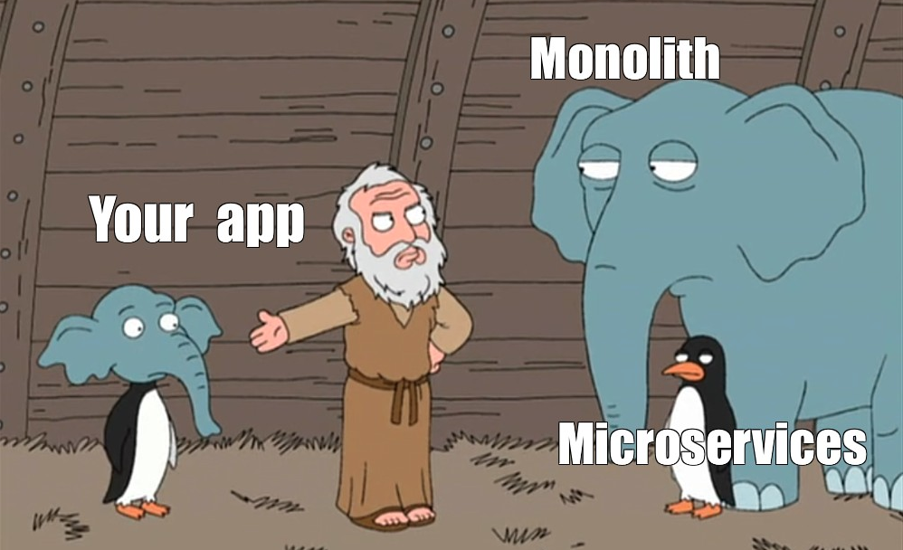
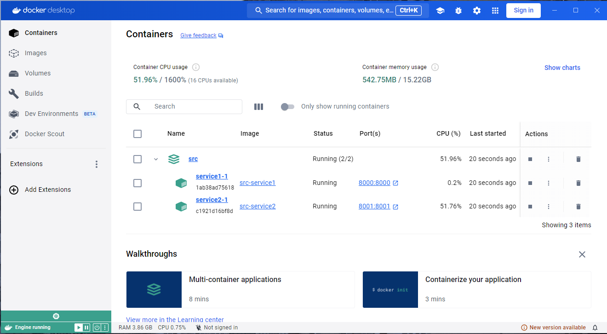
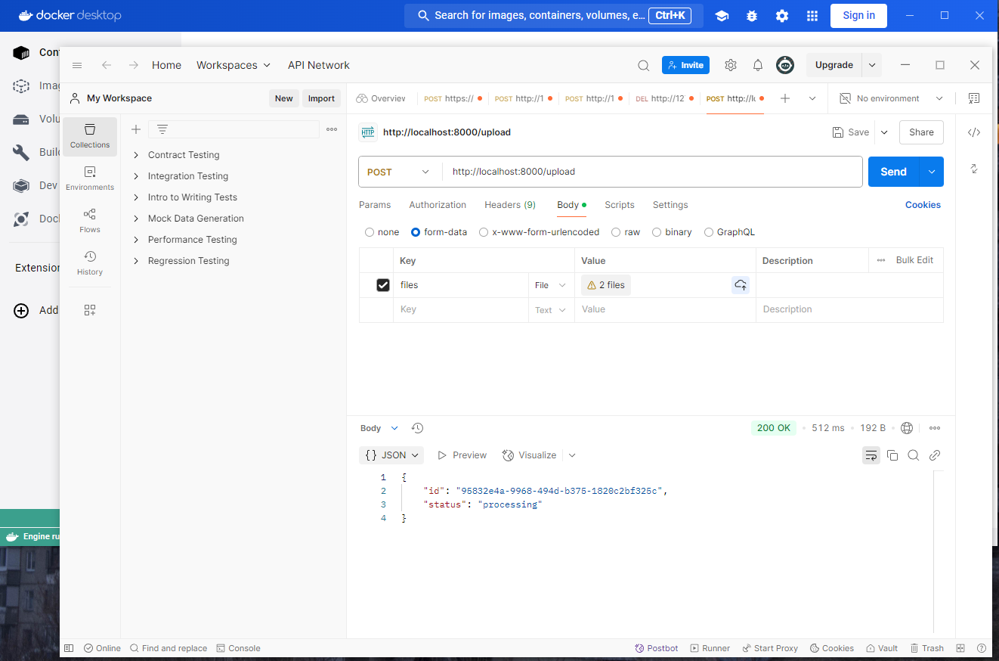
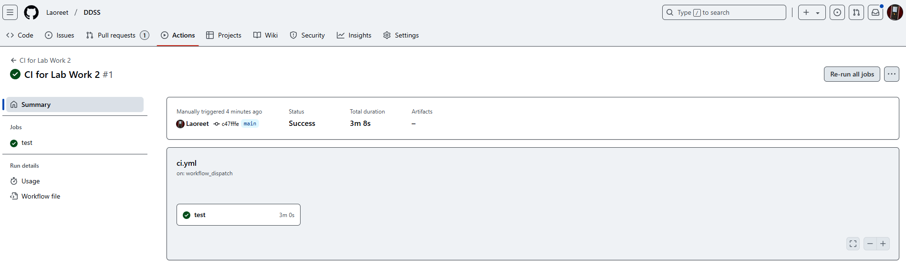

# Практическая работа № 2

### 0. Изменения в коде прошлой работы

**Ушел из DDD.** 
Для DDD приложение оказалось слишком маленьким и слишком простым. Очень мало бизнес-логики. (И в целом не сильно соотносится с целью проекта - проект про ML, подготовку данных, обработку данных, обучение и тестирование нейронки и т.д. и т.п.)

Переделал Dockerfile`ы.

Добавил интеграционные тесты (и они даже заработали! (в конце работы об этом еще будет сказано))

Добавил __pycache__ в .gitignore.

### 1. Определить API Вашей DSS.

API всё так же на FastAPI.

Event-based подход в данном случае является избыточным, т.к. нет какой-то очень сложной логики обработки событий. Проще и быстрее реализовать взаимодействией между сервисами через HTTP-запросы.

Однако, для полноценного такого приложения, если его нужно выводить в прод, по-хорошему было бы прикрутить сюда очереди сообщений (например, Kafka). В целом, так обычно и делают.

В итоге, я пытался реализовать API как асинхронный, но на базе RPC. Использовал асинхронные функции (acyns, await) и асинхронные запросы через httpx (AsyncClient) для взаимодействия между сервисами.

### 2. Разделить Вашу систему на сервисы.

Система была разделена на 2 микросервиса (на 3 раздробить уже просто не успевал, да и дробить тут будто бы особо нечего).

1. #### **Service 1 (API Gateway):**

    - Принимает файлы от пользователя.

    - Сохраняет файлы на диск.

    - Отправляет запрос в Service 2 для обработки.

    - Управляет результатами (удаление, обновление).

    **Интерфейсы:**

    - `POST /upload` — загрузка файлов и запуск обработки.

    - `DELETE /results/{id}` — удаление результатов.

    - `PUT /results/{id}` — обновление метаданных.

2. #### **Service 2 (Processing Service):**

    - Обрабатывает загруженные файлы (DICOM).

    **Интерфейсы:**

    - `POST /process` — обработка загруженных файлов.

    - `GET /results/{id}` — получение результатов обработки.

    - `GET /projections/{id}` — получение проекций.

    - `GET /attention-maps/{id}` — получение карт внимания.

### 3. Обернуть сервисы в Dockerfile и обновить docker-compose.

Для каждого сервиса был отдельно сделан Dockerfile. docker-compose, разумеется, также был обновлен.

В этот раз работоспособность контейнеров проверялась. Оно работает!

### 4. Обновить или написать необходимые тесты.

Были добавлены интеграционные тесты. Активировал их через вкладку Actions на Github`е.

### 5. Подумать над выделением шаблонного репозитория.

Пока еще не до конца понимаю, зачем нужен шаблонный репозиторий для маленьких, неоднотипных проектов.

В теории, можно было бы сделать шаблонный репозиторий для микросервисов, где будут сразу подготовлены базовая структура проекта, наброски докерфайлов (и докер-компоуза), линтеры и автотетсы.