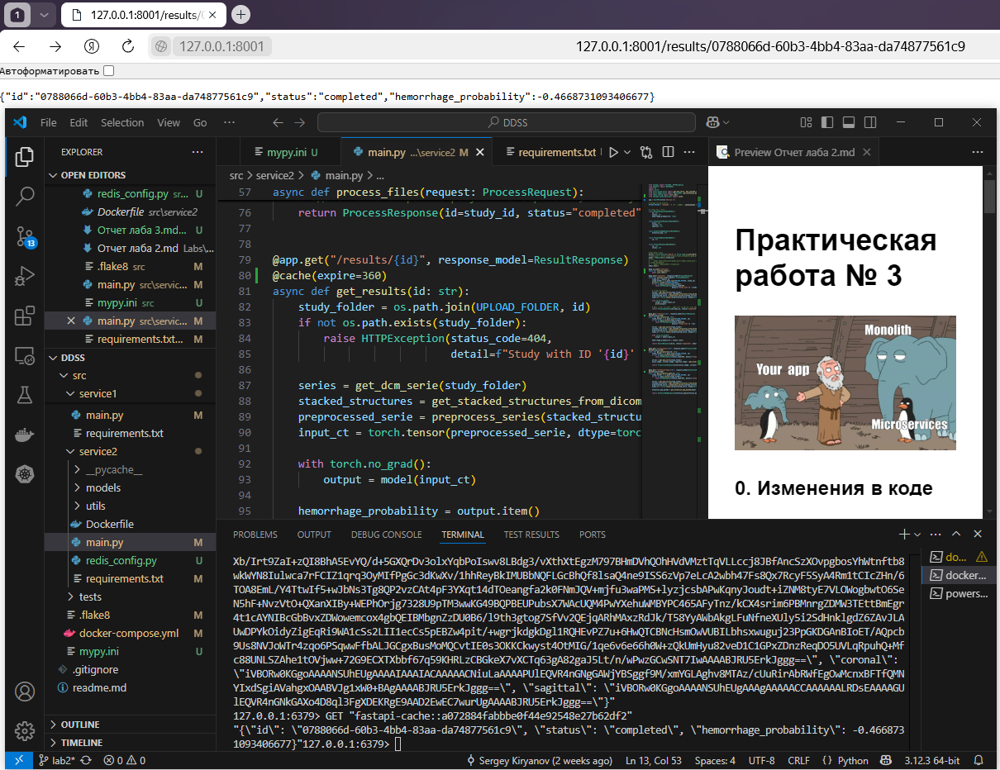
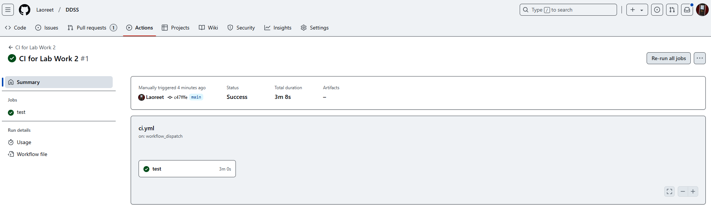

# Практическая работа № 3

### 0. Изменения в коде прошлой работы

Фидбека по прошлой практической я так и не дождался, поэтому, решил все-таки брать наработки из П2.

### 1. Настроить CI-процесс для Вашей распределённой системы.

CI-процесс по сравнению с П2 особо не поменялся.

Добавились проверки линтером и статическим анализатором.

Тесты и все прочее уже и так были.

Чуть-чуть поправил интеграционные тесты.

### 2. Применить одну из техник для масштабирования компонентов Вашей распределённой системы:

Я выбрал и реализовал кэширование данные при помощи Redis'а, т.к. кажется, что в моем проекте это самое разумное.

Вместо того, чтобы, например, заново строить проекции или карты внимания, их куда проще возвращать из кэша. На этом можно сильно сэкономить по вычислениям.

По поводу полной обработки моделью, это не проверял, но в целом, если сделать обработку моделью только 1 раз при загрузке данных, то возможно, что такое кэширование и не понадобится. Все равно результаты получаются отдельно и они уже закэшированы.

Очень удобная штука в плане добавления в проект. Несколько импортов, развертка типа микросервиса, добавление декораторов к существующим методам, и готово.

Если спустя время ключ их кэша станем получать слишком долго, то можно либо попытаться сжать данные, либо увеличить время жизни кэша, либо начать масштабировать сам редис.

### 3. Добавить централизованное логирование микросервисов через GrayLog.

Начал было уже делать логирование через GrayLog - платформа недоступна в РФ.

Почитал хабр, начал смотреть в сторону Splunk - "Компания, без объяснений причин покинула рынок РФ".

Почитал еще хабра, про ELK - показалось просто слишком тяжелым решением и слишком сложным.

### 4. Обновить или написать необходимые тесты.

Были слегка изменены интеграционные тесты. Активировал их через вкладку Actions на Github`е.

### 5. Дополнительные размышления.

К моей работе, основной целью которой являются ML-эксперименты, хорошо бы подходило использование Kubernetes, Kubeflow. Даже хотя бы для простого создания пайплайнов, чтобы облегчить самому себе эксперименты с перебором гиперпараметров модели нейронки. Ну и в целом, эти технологии хотя бы явно применяются по моему стеку.

Но, вместе с этим, информации по развертыванию того же Kubeflow вообще практически нет в легком доступе. Несколько видео с коллегами из Индии и Пакистана помогли мне в свое время развернуть k8s и kubeflow локально, но, опять же, информации по правильному построению тех же пайплайнов не так уж и много. Видимо, слишком узкая тема. И слишком сложная, поэтому нет каких-нибудь условных простеньких видосов по этим темам (по базовому k8s есть).
